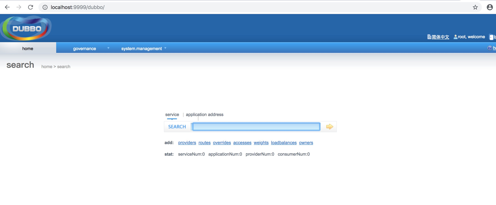

Mac系统搭建docker及常用命令
--

#### 下载docker
官网:https://www.docker.com/
docker下载地址(建议用迅雷下载、其它方式贼慢): https://download.docker.com/mac/stable/Docker.dmg

下载完了安装 -> 启动  。。。此处略

#### 镜像仓库地址
官方镜像地址:https://hub.docker.com/explore/
国内网易云镜像:https://c.163yun.com/hub#/m/home/

#### docker镜像常用命令
获取: docker pull hub.c.163.com/library/tomcat:latest
查看: docker images
删除: docker rmi hub.c.163.com/library/tomcat:latest

例如:
```shell
tanyawendeMacBook-Pro:target tanyawen$ docker images
REPOSITORY                     TAG                 IMAGE ID            CREATED             SIZE
hub.c.163.com/library/tomcat   latest              72d2be374029        13 months ago       292MB
```

#### docker容器常用命令
* 后台启动: docker run -d hub.c.163.com/library/tomcat 
说明 -d: 后台运行
* 进入:docker exec –it [container] /bin/bash
* 停止:docker stop [container]
* 删除:docker rm [container]
* 保存:docker commit [container id] [image:version]
* 挂载映射端口:docker run -d  -p 9999:8080 hub.c.163.com/library/tomcat 
-p 将本地端口9999 映射到容器8080端口

#### 小试牛刀(使用docker容器运行java-web应用、此处以dubbo管理后台为例、也可以用其它任何的web应用)
说明:dubbo管理后台依赖zookeeper 本机需要安装zookeeper

1、编写Dockerfile文件

```shell
FROM hub.c.163.com/library/tomcat
MAINTAINER tanyawen
COPY ./dubbo.war /usr/local/tomcat/webapps
```
命令说明:
* FROM: 依赖的容器 同一dockerfile可以多次使用此命令
* MAINTAINER: 所属人
* COPY:将本地的war包 copy到容器中的某个目录 

详细命令参考文档:https://www.jianshu.com/p/cad3ec6e91cb

2. 构建
docker build . -t dubbo:lastest
容器中多了个dubbo容器
```shell
tanyawendeMacBook-Pro:target tanyawen$ docker images
REPOSITORY                     TAG                 IMAGE ID            CREATED             SIZE
dubbo                          lastest             6fb31a9a670b        10 hours ago        325MB
hub.c.163.com/library/tomcat   latest              72d2be374029        13 months ago       292MB
```

3. 启动
docker run -d -p 9999:8080 6fb31a9a670b

```shell
tanyawendeMacBook-Pro:target tanyawen$ docker run -d -p 9999:8080 6fb31a9a670b
7b224864a48df612d2b3b46b005edcddedb4058f46bbc935ec613845cd20d714
```

大功告成:




