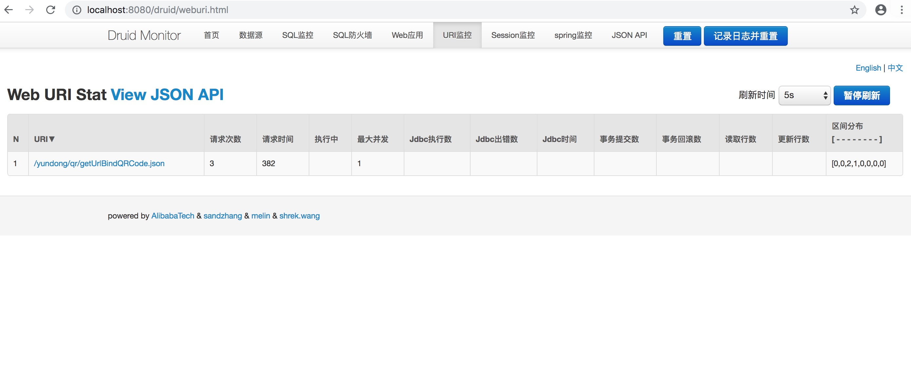

springboot 整合druid数据库连接池 并且配置监控
--
## 1、druid简介

Druid是一个非常优秀的数据库连接池。在功能、性能、扩展性方面，都超过其他数据库连接池，包括DBCP、C3P0、BoneCP、Proxool、JBoss DataSource。

Druid已经在阿里巴巴部署了超过600个应用，经过一年多生产环境大规模部署的严苛考验。
Druid是一个JDBC组件，它包括三个部分：
* 基于Filter－Chain模式的插件体系。
* DruidDataSource 高效可管理的数据库连接池。
* SQLParser

## 2、配置依赖
```xml
<!--配置容错处理-->
        <dependency>
            <groupId>org.springframework.boot</groupId>
            <artifactId>spring-boot-configuration-processor</artifactId>
            <optional>true</optional>
        </dependency>
        <dependency>
            <groupId>com.alibaba</groupId>
            <artifactId>druid</artifactId>
            <version>1.0.26</version>
        </dependency>
        
         <dependency>
            <groupId>mysql</groupId>
            <artifactId>mysql-connector-java</artifactId>
            <version>8.0.11</version>
         </dependency>    
```
## 3、application.properties配置信息
```properties
spring.datasource.driver-class-name=com.mysql.cj.jdbc.Driver
spring.datasource.url=jdbc:mysql://HOST:PORT?useUnicode=true&characterEncoding=UTF8&characterSetResults=UTF8&autoReconnect=true&useSSL=false&useLegacyDatetimeCode=false&serverTimezone=Asia/Shanghai
spring.datasource.username=USERNAME
spring.datasource.password=PASSWORD
# Hikari will use the above plus the following to setup connection pooling
spring.datasource.type=com.alibaba.druid.pool.DruidDataSource
#--------------------------
# 下面为连接池的补充设置，应用到上面所有数据源中
# 初始化大小，最小，最大
spring.datasource.initialSize=5
spring.datasource.minIdle=2
spring.datasource.maxActive=50
# 配置获取连接等待超时的时间
spring.datasource.maxWait=60000
# 配置间隔多久才进行一次检测，检测需要关闭的空闲连接，单位是毫秒
spring.datasource.timeBetweenEvictionRunsMillis=60000
# 配置一个连接在池中最小生存的时间，单位是毫秒
spring.datasource.minEvictableIdleTimeMillis=300000
spring.datasource.validationQuery=SELECT 1 FROM DUAL
spring.datasource.testWhileIdle=true
spring.datasource.testOnBorrow=false
spring.datasource.testOnReturn=false
# 打开PSCache，并且指定每个连接上PSCache的大小
spring.datasource.poolPreparedStatements=true
spring.datasource.maxPoolPreparedStatementPerConnectionSize=20
# 配置监控统计拦截的filters，去掉后监控界面sql无法统计，'wall'用于防火墙
spring.datasource.filters=stat,wall,log4j
# 通过connectProperties属性来打开mergeSql功能；慢SQL记录
spring.datasource.connectionProperties=druid.stat.mergeSql=true;druid.stat.slowSqlMillis=5000
# 合并多个DruidDataSource的监控数据
spring.datasource.useGlobalDataSourceStat=true
```

## 4、Druid 监控配置
```java
package com.yundong.qrcode.server.config;

import com.alibaba.druid.support.http.StatViewServlet;
import com.alibaba.druid.support.http.WebStatFilter;
import org.springframework.boot.web.servlet.FilterRegistrationBean;
import org.springframework.boot.web.servlet.ServletRegistrationBean;
import org.springframework.context.annotation.Bean;
import org.springframework.context.annotation.Configuration;

@Configuration
public class DruidConfiguration {
    @Bean
    public ServletRegistrationBean statViewServle()
    {
        ServletRegistrationBean servletRegistrationBean = new ServletRegistrationBean(new StatViewServlet(),"/druid/*");
        //IP白名单
        servletRegistrationBean.addInitParameter("allow", "127.0.0.1");
        //IP黑名单
        servletRegistrationBean.addInitParameter("deny", "192.168.1.100");
        //控制台管理用户
        servletRegistrationBean.addInitParameter("loginUsername","ADMIN");
        servletRegistrationBean.addInitParameter("loginPassword", "ADMIN");
        //是否能够重置数据
        servletRegistrationBean.addInitParameter("resetEnable", "false");
        return servletRegistrationBean;
    }
    @Bean
    public FilterRegistrationBean statFilter()
    {
        FilterRegistrationBean filterRegistrationBean = new FilterRegistrationBean(new WebStatFilter());
        //添加过滤规则
        filterRegistrationBean.addUrlPatterns("/*");
        //忽略过滤的格式
        filterRegistrationBean.addInitParameter("exclusions", "*.js,*.gif,*.jpg,*.png,*.css,*.ico,/druid/*");
        return filterRegistrationBean;
    }
}

```

## 最终效果



